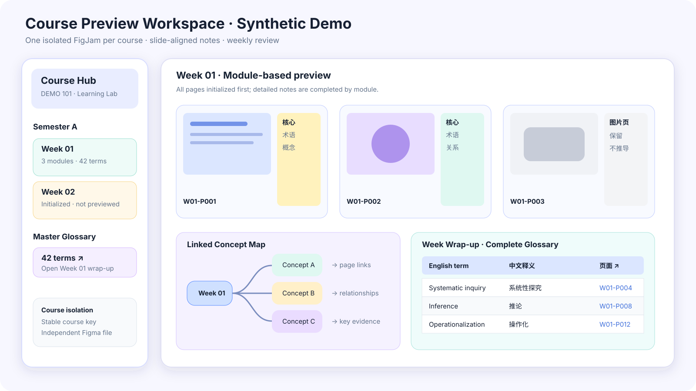
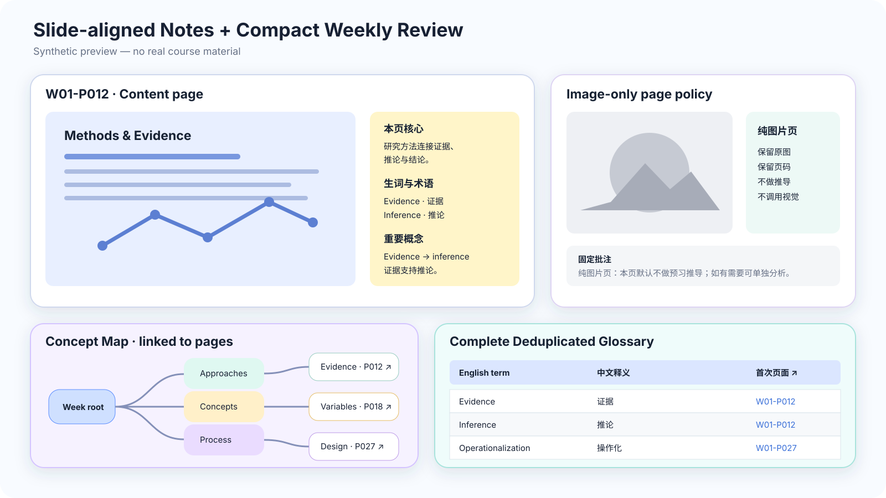

# Preview Course in FigJam

[中文说明](#中文说明) · [Installation](#installation) · [Usage](#usage) · [Privacy](#privacy)

An open-source Codex skill that turns uploaded PDF/PPTX course materials into an isolated FigJam study workspace with slide-aligned Chinese notes, English-to-Chinese terminology, weekly glossaries, and linked concept maps.





## Highlights

- One independent FigJam file per course; weeks and terms never mix across courses.
- Initializes the complete weekly deck, then previews one Module/Part at a time.
- Keeps every original slide beside its annotation panel.
- Produces source-grounded, deeply explained Chinese notes while preserving and consistently translating English course keywords.
- Builds a complete deduplicated glossary and a clickable weekly concept map.
- Validates note structure, bilingual terminology, and source markers before writing to FigJam.
- Keeps low-information pages to one sentence.
- Preserves image-only slides but deliberately skips visual inference to save tokens.
- Stores only routing/checkpoint metadata locally—never slide text or notes.

## Installation

### Download with Git

```bash
git clone https://github.com/3519130448wzr-alt/preview-course-in-figjam.git
mkdir -p ~/.codex/skills
cp -R preview-course-in-figjam/skill/preview-course-in-figjam ~/.codex/skills/
```

Open a new Codex conversation after installation. The skill should appear as `$preview-course-in-figjam`.

### Download without Git

1. Use GitHub's **Code → Download ZIP**.
2. Unzip the repository.
3. Copy `skill/preview-course-in-figjam` into `~/.codex/skills/`.
4. Start a new Codex conversation.

## Requirements

- Codex with the Figma integration connected.
- Python 3.10+.
- Python packages from `requirements.txt` when Codex's bundled document runtime is unavailable.
- Poppler (`pdftoppm`) for PDF rendering.
- LibreOffice (`soffice`) for PPTX rendering.

On macOS with Homebrew:

```bash
brew install poppler libreoffice
python3 -m pip install -r requirements.txt
```

## Usage

Upload a syllabus and/or a weekly PDF/PPTX deck, then use a prompt such as:

```text
Use $preview-course-in-figjam.
Course: DEMO 101 Research Skills
This is Week 1. Initialize the whole week, then preview Module 1.
```

Continue in a new conversation with:

```text
Use $preview-course-in-figjam to continue DEMO 101 Week 1 and preview Module 2.
```

The skill resolves the existing course FigJam through `~/.codex/course-preview/registry.json` and refuses to silently rebind a course to another file.

### Default page behavior

| Page type | Result |
| --- | --- |
| Normal content | Core idea, terminology, concept relationships, class-confirmation points |
| Divider, assessment, agenda, ending | One factual sentence |
| Image only | Original page plus a fixed skip note; no vision-model inference |
| Blank | Original page number plus a blank-page marker |

The workflow uses the lecture deck first, then user-designated course readings. Only when those sources cannot clarify a concept may it run a limited check against primary papers or authoritative academic sources; an explicit no-browse request is always respected. Reading and web supplements stay visibly separate from lecture claims. It does not create quizzes or include pronunciation or parts of speech.

## Generated FigJam structure

```text
Course Hub
└── Term
    └── Week
        ├── Module / Part
        │   └── Wxx-Pxxx slide + side note cards
        └── Weekly review
            ├── Linked concept map
            └── Complete deduplicated glossary
```

All glossary page labels and concept-map nodes link back to representative slide cards.

## Included utilities

| Script | Purpose |
| --- | --- |
| `deck_manifest.py` | Extract slide text and classify PDF/PPTX pages |
| `render_deck.py` | Render selected PDF/PPTX slides into numbered PNG files |
| `course_registry.py` | Maintain privacy-minimal course/FigJam routing and checkpoints |
| `glossary_dedupe.py` | Normalize and deduplicate structured weekly terminology |
| `validate_note_payload.py` | Check note structure, bilingual terminology consistency, and supplement source markers before FigJam writes |

## Privacy

The persistent registry contains course identifiers, FigJam file keys, source fingerprints, node IDs, and completion checkpoints. It does **not** contain slide text, notes, rendered pages, absolute file paths, or user questions.

The screenshots in this repository are synthetic mockups and contain no real course materials.

## 中文说明

`preview-course-in-figjam` 是一个面向 Codex 的开源课程预习 Skill。它会将课程大纲和每周 PDF/PPTX 课件整理到 FigJam 中，并建立逐页侧边批注、完整去重术语表和可点击的周概念图。

主要规则：

- 每门课程使用一个独立 FigJam，不同课程不会串线。
- 上传整周课件后先建立全部页面，再按照 Module/Part 批量预习。
- 正常知识页提供中文解释并保留英文关键词。
- 衔接页、Assessment、目录和结束页只做一句话概括。
- 纯图片页保留原图与页码，但不调用视觉推理，避免浪费 token。
- 优先依据课件及相邻页面，再按需使用用户指定的课程阅读；仍无法澄清概念时，才做小范围权威来源核实，并将补充内容与课件原意分开标注。用户明确要求不联网时始终遵守。
- 写入 FigJam 前校验笔记结构、术语翻译一致性及补充来源标记。
- 不出题，不记录词性和发音。
- 同一课程在新对话中可通过本机轻量索引继续使用原 FigJam。

安装后，在新对话中上传课件并输入：

```text
使用 $preview-course-in-figjam。
课程代码为 XXX，这是 Week 1 课件。请先初始化整周，然后预习 Module 1。
```

## License

Released under the [MIT License](LICENSE).
